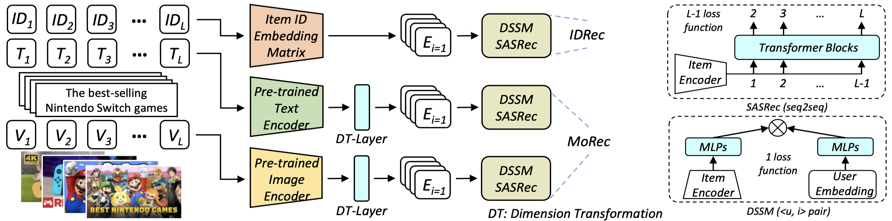

# IDvs.MoRec 
This repository contains the source code for the **SIGIR 2023** paper **''Where to Go Next for Recommender Systems? ID- vs. Modality-based Recommender Models Revisited''**.

Full version in [[PDF]](https://arxiv.org/pdf/2303.13835.pdf).

 


## Invited Talk by Google DeepMind [(Slides)](https://github.com/westlake-repl/MicroLens/blob/master/MicroLens_DeepMind_Talk.pdf)


## Requirements
```
- torch == 1.7.1+cu110
- torchvision==0.8.2+cu110
- transformers==4.20.1
```


## Preparation

### Data Download 
The complete news recommendation dataset (MIND) is visible under the `dataset/MIND`, and the dataset with vision (HM and Bili) requires the following actions:

Download the image file "hm_images.zip" (100,000 images in 3x224x224 size) for Hm dataset from this [link](https://drive.google.com/file/d/1zm0V3th-_ZxAevQM5yt8tkbLHnXGc6lk/view?usp=share_link). 

Unzip the downloaded model file `hm_images.zip`, then put the unzipped directory `hm_images` into `dataset/Hm/` for the further processing.

**Mentions: The Bili dataset we used is from an unpublished paper, temporarily available via email (yuanfajie@westlake.edu.cn, lifengyi@westlake.edu.cn). Please fill out the applicant form `The Usage Guidelines of Bili.pdf` and provide your name and affiliation information (using official email) when requesting the dataset via email. Please send the same application email to the 2 email addresses mentioned above.**
 


### Data Preparation
You need to process the images file of HM dataset to a LMDB database for efficient loading during training.

```
cd dataset/HM
python run_lmdb_hm.py
```

### Pre-trained Model Download

We report details of the pre-trained ME we used in Table. Download the pytorch-version of them, and put the checkpoint `pytorch_model.bin` into the corresponding path under `pretrained_models/`

| Pre-trained model | #Param. | URL |
| --- | --- | --- |
| BERT<sub>tiny</sub> | 4M  | https://huggingface.co/prajjwal1/bert-tiny |
| BERT<sub>small</sub> | 29M | https://huggingface.co/prajjwal1/bert-small |
| BERT<sub>base</sub> | 109M | https://huggingface.co/bert-base-uncased |
| RoBERTa<sub>base</sub> | 125M | https://huggingface.co/roberta-base |
| OPT<sub>125M</sub> | 125M | https://huggingface.co/facebook/opt-125M |
| ResNet18 | 12M | https://download.pytorch.org/models/resnet18-5c106cde.pth |
| ResNet34 | 22M | https://download.pytorch.org/models/resnet34-333f7ec4.pt |
| ResNet50 | 26M | https://download.pytorch.org/models/resnet50-19c8e357.pth |
| Swin-T | 28M | https://huggingface.co/microsoft/swin-tiny-patch4-window7-224 |
| Swin-B | 88M | https://huggingface.co/microsoft/swin-base-patch4-window7-224 |
| MAE<sub>base</sub> | 86M | https://huggingface.co/facebook/vit-mae-base |

## Training
An example:
For training text MoRec with SASRec in **end2end** manner, and using **bert-base** as the modality encoder:
```
cd bce_text/main-end2end
python train_bert_base.py
```
After training, you will get the checkpoint of the MoRec model, then set the parameters in  `test_bert_base.py` and run it for the test result.

**Mentions:**
You can change the `train_xxx.py` and the `test_xxx.py` to set the hyperparameters.
The recommended GPU resource can be found in Table 6 in the paper.

## !!!A better training strategy!!!
### In-batch debiased cross-entropy loss

We find that using in-batch debiased cross-entropy loss can significantly enhance the performance of IDRec and MoRec compared with the binary cross-entropy loss:

```math
-\sum\limits_{u \in \mathcal{U}} \sum\limits_{ i \in [2,...,L]}  \log \frac{\exp(\hat{y}_{ui} - \log(p_i))}{\exp(\hat{y}_{ui} - \log(p_i)) + \sum_{j \in [B], j \notin I_u} \exp(\hat{y}_{uj} - \log(p_j))}
```

where $p_i$ represents the popularity of item $i$ in the dataset. We conducted experiments on in-batch debiased cross-entropy loss using SASRec and report the results:

| Dataset | Metrics | IDRec | BERT<sub>small</sub>| RoBERTa<sub>base</sub> | Improv. |
| --- | --- | --- | --- | --- | --- |
| MIND | HR@10 | 22.60 | 22.96  | **23.00** | +1.77% |
| MIND | NDCG@10 | 12.57 | **12.82**  | **12.82** | +1.99% |
| **Dataset** | **Metrics** | **IDRec** | **ResNet50**| **Swin-B** | **Improv.** |
| HM  | HR@10 | 11.94 | 11.90 | **12.26** | +2.68% |
| HM  | NDCG@10 | **7.75** | 7.46 | 7.70 | -0.65% |
| Bili | HR@10 | 4.91 | 5.62 | **5.73** | +16.70% |
| Bili | NDCG@10 | 2.71 | 3.08  | **3.14** | +15.87% |

It can be seen from the results that both IDRec and MoRec have been greatly improved compared with the binary loss used in our paper. The experiments also showed that the convergence speed was significantly accelerated when using the in-batch debias loss. It is worth noting that  under this training setting, the viewpoints in our paper are still confirmed.

We release the code of SASRec with the in-batch debias cross-entropy loss in `inbatch_sasrec_e2e_text` and `inbatch_sasrec_e2e_vision`, the way of running the codes is the same as described above.


## Citation
If you use our code or find IDvs.MoRec useful in your work, please cite our paper as:

```bib
@inproceedings{yuan2023go,
title = {Where to Go Next for Recommender Systems? ID- vs. Modality-based Recommender Models Revisited},
author = {Yuan, Zheng and Yuan, Fajie and Song, Yu and Li, Youhua and Fu, Junchen and Yang, Fei and Pan, Yunzhu and Ni, Yongxin},
booktitle = {Proceedings of the 46th International ACM SIGIR Conference on Research and Development in Information Retrieval},
pages = {2639–2649},
year = {2023}
}
```
## Recruiting
If you have an innovative idea for building a foundational recommendation model but require a large dataset and computational resources, consider joining our lab as an intern. We can provide access to 100 NVIDIA 80G A100 GPUs and a billion-level dataset of user-video/image/text interactions.

The laboratory is hiring research assistants, interns, doctoral students, and postdoctoral researchers. Please contact the corresponding author for details.

实验室招聘科研助理，实习生，博士生和博士后，请联系通讯作者。

